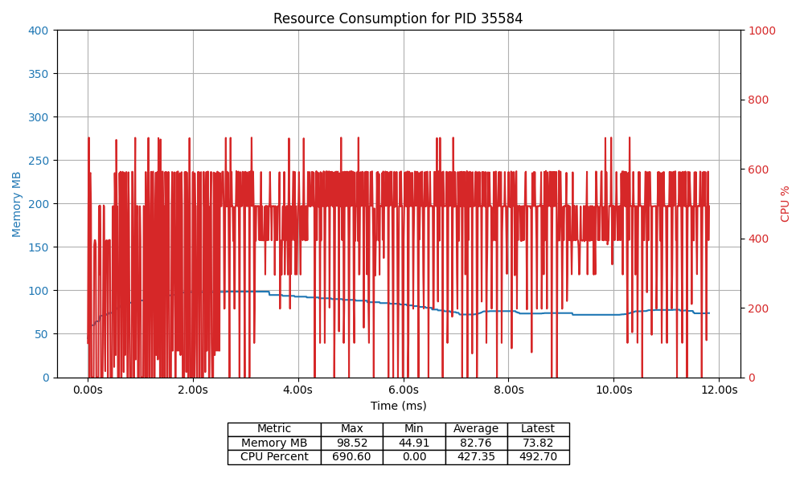
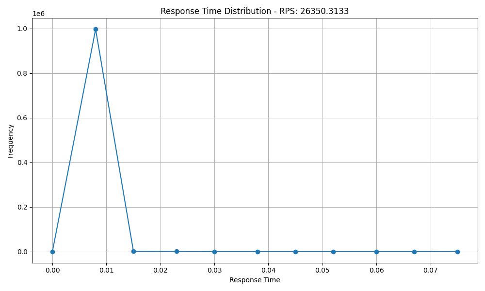

# GraalVM Bootcamp Series

## Serie 3. Optimizing native image for peak performance environments:
- 📽️ [Watch the Video](https://www.youtube.com/watch?v=2_XJcnkMg5k)


With this serie you will learn multiple options to optimize native images to several purposes. By general you can optimize for:
- High throughput
    - G1GC: Use the G1 GC `--gc=G1`
    - Use Profile-Guided Optimizations `--pgo`
- Compute resources comsuption: CPU & memory
- Build time
    - Use the quick build mode `-Ob`
- Executable size
    - Use `upx` tool to compress the executable.

Follow these instructions to walkthrough `quarkus` [application](https://github.com/czelabueno/graalvm-bootcamp-series/tree/pgo-g1/Serie3-OptimizingNativeImage/quarkus-aot-sample) 

## Reproduce this demo

#### Clone repo
```
$ git clone https://github.com/czelabueno/graalvm-bootcamp-series.git
```
#### Do checkout on the `pgo-g1` branch
```
$ git checkout pgo-g1
```

## Prerequisites 
You must installed following tools:
- `Oracle GraalVM for JDK 17 or 20`
- `hey` - HTTP load testing latest
- `upx` - Ultimate Packer for eXecutables 4.1.x
- Python libs - `psutil` and `matplotlib`

If you haven't these tools, you can install its using below shell scripts:
```
$ ./setup.sh
```
`pip` will be already installed
```
$cd Serie3-OptimizingNativeImage
$ ./setup-py.sh
```
## Knowing the `quarkus` sample code
Quarkus have a strong integration with `graalvm` and you can use more confortable way to config `maven` plugin.
```
$ cd quarkus-aot-sample
```

This sample app use `application.properties` and use quarkus profiles to build multiple types of native images and pass different parameters. This way we gonna go optimizing until reach a peak performance image. 

### Sample code to expose a HTTP GET Api
```java
@Path("/community")
public class CommunityResource {

    private Community community;

    CommunityResource(){
        community = new Community("PeruJUG",List.of("Carlos Zela","Jose Diaz",".."));
    }

    @GET
    @Produces(MediaType.APPLICATION_JSON)
    public Community community(){
        return this.community;
    }
    
}

record Community (String name, List<String> members){}
```
### Helping me from quarkus profiles to create native images on `application.properties`
```properties
quarkus.native.additional-build-args=\
    -H:+StaticExecutableWithDynamicLibC, \
    -H:+ReportExceptionStackTraces, \
    -R:MaximumHeapSizePercent=25, \
    -H:-MLProfileInference
%g1.quarkus.native.additional-build-args=\
    --gc=G1,\
    -H:+StaticExecutableWithDynamicLibC, \
    -H:+ReportExceptionStackTraces
%pgoinst.quarkus.native.additional-build-args=\
    --gc=G1,\
    -H:+StaticExecutableWithDynamicLibC, \
    -H:+ReportExceptionStackTraces, \
    --pgo-instrument
%pgo.quarkus.native.additional-build-args=\
    --gc=G1,\
    -H:+StaticExecutableWithDynamicLibC, \
    -H:+ReportExceptionStackTraces, \
    --pgo=/workspace/graalvm-bootcamp-series/Serie3-OptimizingNativeImage/quarkus-aot-sample/default.iprof, \
    -march=native
%upx.quarkus.native.additional-build-args=\
    --gc=G1,\
    -H:+StaticExecutableWithDynamicLibC, \
    -H:+ReportExceptionStackTraces, \
    --pgo=/workspace/graalvm-bootcamp-series/Serie3-OptimizingNativeImage/quarkus-aot-sample/default.iprof, \
    -march=native
%upx.quarkus.native.compression.level=10
%upx.quarkus.native.compression.additional-args=--lzma
```
if you want to know more about `quarkus` and `graalvm` integration, check this [link](https://quarkus.io/guides/building-native-image#configuration-reference)
### 

## Building `JIT` and `AOT` executables

### Generating `uber-jar` JIT java executable
Known as fat-jar, a java executable that contains all libs. 
```
$./build.sh
```
Check executable with this command:
```
$ls -lh target/quarkus-aot-sample-1.0.0-SNAPSHOT-runner.jar
```
### Generating AOT `native-image` without optimizations.
Building native image using default configurations/arguments.
```
$ ./build-ni.sh
```
Check executable with this command:
```
$ ls -lh target/quarkus-aot-sample-ni-runner
```
Good! We gonna start comparing both executables from resource consumption and throughput perspective.

### Running load testing for JIT and AOT executables without optimizations

#### JAR executable

```
$ java -jar target/quarkus-aot-sample-1.0.0-SNAPSHOT-runner.jar &
$ pid=$(ps aux | grep quarkus-aot-sample-1.0.0-SNAPSHOT-runner.jar | awk '{print $2; exit}')
```
Execute load testing using a `python` program to create `histogram` and `charts` and copy/paste PID.
```
$ cd ..
$ python realtime_histogram.py $pid jit
$ kill $pid
$ tree bench-histograms
```
Output folder
```
bench-histograms/
├── jit
│   ├── jit_consumption_graph.png
│   ├── jit_hey_load_test_output.md
│   └── jit_latency_graph.png
```
Oracle GraalVM JDK 17 `JIT mode`


#### Native image by default
To execute load testing for native image executable we will simplify task using `load-test.sh`.

This shell `load-test.sh` require only one parameter `<profile>`

```
$ ./load-test.sh ni
$ tree bench-histograms
```
Output folder
```
bench-histograms/
├── ni
│   ├── ni_consumption_graph.png
│   ├── ni_hey_load_test_output.md
│   └── ni_latency_graph.png
```
Oracle GraalVM `AOT mode` by default




You can see that we got a impressive improvement!! 

## Creating more AOT executables with PGO + G1 and UPX
Repeat same action for rest profiles to create executables more optimized.

### G1

We back to `quarkus-aot-sample` folder
```
$ cd quarkus-aot-sample
```
We build a native executable using G1 Garbage Collector instead of Serial GC. G1 use large memory space in the `heap` area to support high volumes throughput.
```
$ ./build-g1.sh
```
Output artifact
```
$ ls lh target/quarkus-aot-sample-g1-runner
```

Running load testing `1 million requests` with 10 `hey` workers. 

```
$ cd ..
$ ./load-test.sh g1
```
### Oracle GraalVM Native Image PGO + G1
Now we can join the G1 power with PGO power in the same native image executable.

### PGO Instrument
For that we gonna to `instrument` a generated executable to collect data for `PGO`. So this way you can execute performance testing and prepare you native executable to support an expected and long running hight throughput scenarios. 


Building PGO instrument executable
```
$ ./build-pgoinst.sh
```
Run application to instrument
```
$ ./target/quarkus-aot-sample-pgoinst-runner
```
Execute perf testing, for example 2MM requests:

```
$ hey -n 2000000 -c 100 http://localhost:8080/community
```
Stop application, once stopped a `default.iprof` file will be generated with all instructions to build native executables guided.

### PGO
### Generate executable with PGO.
```
$ ./build-pgo.sh
```
#### Output artifact
```
$ ls -lh target/quarkus-aot-sample-pgo-runner
```
#### Executing bench testing
```
$ cd ..
$ ./load-test.sh pgo
```
#### Histogram and graph
Oracle GraalVM `AOT mode` with PGO+g1


hey output
```
Summary:
  Total:	42.5035 secs
  Slowest:	0.0727 secs
  Fastest:	0.0001 secs
  Average:	0.0004 secs
  Requests/sec:	23527.4662
  
  Total data:	65000000 bytes
  Size/request:	65 bytes

Response time histogram:
  0.000 [1]	|
  0.007 [996529]	|■■■■■■■■■■■■■■■■■■■■■■■■■■■■■■■■■■■■■■■■
  0.015 [1247]	|
  0.022 [133]	|
  0.029 [0]	|
  0.036 [10]	|
  0.044 [1]	|
  0.051 [16]	|
  0.058 [111]	|
  0.065 [450]	|
  0.073 [1502]	|


Latency distribution:
  10% in 0.0002 secs
  25% in 0.0002 secs
  50% in 0.0003 secs
  75% in 0.0003 secs
  90% in 0.0004 secs
  95% in 0.0004 secs
  99% in 0.0009 secs

Details (average, fastest, slowest):
  DNS+dialup:	0.0000 secs, 0.0001 secs, 0.0727 secs
  DNS-lookup:	0.0000 secs, 0.0000 secs, 0.0004 secs
  req write:	0.0000 secs, 0.0000 secs, 0.0681 secs
  resp wait:	0.0004 secs, 0.0001 secs, 0.0726 secs
  resp read:	0.0000 secs, 0.0000 secs, 0.0682 secs

Status code distribution:
  [200]	1000000 responses
```

### UPX to reduce executable size.
If one of your main criteri is save storage space, `upx` is a excelent compressor tool for native executables.

`quarkus` have a native support to package a final artifact using upx.

Note that UPX compression:

- increases your build time, mainly if you use high-compression levels

- increases the startup RSS usage of the application


Building a `upx` native executable was built with `pgo` + `G1`

```
$ cd quarkus-aot-sample
$ ./build-upx.sh
```
#### Running bench load testing
```
$ cd ..
$ ./load-test.sh upx
```
#### Histogram and graph
Oracle GraalVM `AOT mode` PGO+G1 compressed with `UPX`


hey output
```
Summary:
  Total:	54.2071 secs
  Slowest:	0.0789 secs
  Fastest:	0.0001 secs
  Average:	0.0005 secs
  Requests/sec:	18447.7527
  
  Total data:	65000000 bytes
  Size/request:	65 bytes

Response time histogram:
  0.000 [1]	|
  0.008 [995619]	|■■■■■■■■■■■■■■■■■■■■■■■■■■■■■■■■■■■■■■■■
  0.016 [463]	|
  0.024 [12]	|
  0.032 [10]	|
  0.040 [0]	|
  0.047 [59]	|
  0.055 [163]	|
  0.063 [749]	|
  0.071 [2869]	|
  0.079 [55]	|


Latency distribution:
  10% in 0.0002 secs
  25% in 0.0002 secs
  50% in 0.0003 secs
  75% in 0.0003 secs
  90% in 0.0004 secs
  95% in 0.0005 secs
  99% in 0.0009 secs

Details (average, fastest, slowest):
  DNS+dialup:	0.0000 secs, 0.0001 secs, 0.0789 secs
  DNS-lookup:	0.0000 secs, 0.0000 secs, 0.0009 secs
  req write:	0.0000 secs, 0.0000 secs, 0.0645 secs
  resp wait:	0.0005 secs, 0.0001 secs, 0.0789 secs
  resp read:	0.0000 secs, 0.0000 secs, 0.0680 secs

Status code distribution:
  [200]	1000000 responses
```

### Checking executables sizes
It's important remember that all native image executables were generated as `mostly static` and these are included `glibc` OS dynamic libs which size can be increased.
Still like that `quarkus-aot-sample-upx-runner` executable have smallest size as we expected.

```
gitpod@czelabueno: ls -lhS target/*runner*
-rwxr-xr-x 1 gitpod gitpod 228M Sep  5 23:10 quarkus-aot-sample-pgoinst-runner
-rwxr-xr-x 1 gitpod gitpod  69M Sep  6 01:38 quarkus-aot-sample-g1-runner
-rwxr-xr-x 1 gitpod gitpod  54M Sep  5 22:24 quarkus-aot-sample-ni-runner
-rwxr-xr-x 1 gitpod gitpod  40M Sep  5 23:38 quarkus-aot-sample-pgo-runner
-rw-r--r-- 1 gitpod gitpod  16M Sep  5 22:53 quarkus-aot-sample-1.0.0-SNAPSHOT-runner.jar
-rwxr-xr-x 1 gitpod gitpod  14M Sep  5 22:17 quarkus-aot-sample-upx-runner
```

## Benchmarking of JIT vs AOT executable (PGO, PGO+G1, UPX)

Repeat same action for rest profiles to 
```
bench-histograms/
├── g1
│   ├── g1_consumption_graph.png
│   ├── g1_hey_load_test_output.md
│   └── g1_latency_graph.png
├── jit
│   ├── jit_consumption_graph.png
│   ├── jit_hey_load_test_output.md
│   └── jit_latency_graph.png
├── ni
│   ├── ni_consumption_graph.png
│   ├── ni_hey_load_test_output.md
│   └── ni_latency_graph.png
├── pgo
│   ├── pgo_consumption_graph.png
│   ├── pgo_hey_load_test_output.md
│   └── pgo_latency_graph.png
└── upx
    ├── upx_consumption_graph.png
    ├── upx_hey_load_test_output.md
    └── upx_latency_graph.png
```
